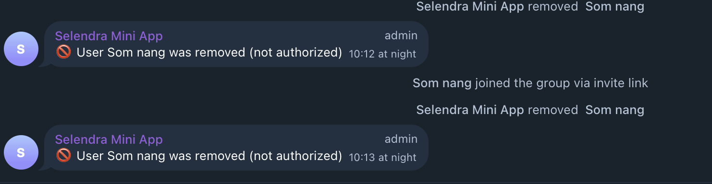

# Telegram Whitelist Bot 🤖

[](https://opensource.org/licenses/MIT)
[](https://nodejs.org/)
[](https://github.com/sokunsamnang/telegram-whitelist-bot/issues)
[](https://github.com/sokunsamnang/telegram-whitelist-bot/stargazers)

A powerful Node.js Telegram bot that automatically manages group access using a whitelist system. Perfect for protecting private groups from unauthorized users while maintaining seamless access for approved members.

## 📸 Screenshot



## ✨ Features

-   **Auto-Kick Non-Whitelisted Users**: Automatically removes users who join but aren't on the whitelist
-   **Whitelist Management**: Add/remove users from the whitelist via commands
-   **Admin Controls**: Secure admin-only commands for managing the whitelist
-   **Real-time Monitoring**: Monitors new member joins in real-time
-   **Comprehensive Logging**: Detailed logging of all actions and events
-   **Welcome Messages**: Optional welcome messages for approved users
-   **Status Monitoring**: Check bot status and whitelist statistics

## 🚀 Quick Start

> **⚠️ Security First**: This bot is now ready for GitHub! All sensitive data has been removed and secured.

```bash
# 1. Clone the repository
git clone https://github.com/sokunsamnang/telegram-whitelist-bot.git
cd telegram-whitelist-bot

# 2. Install dependencies
npm install

# 3. Configure your bot (choose one method)
# Method A: Using config file
cp config.example.js config.js
# Edit config.js with your bot credentials

# Method B: Using environment variables
cp .env.example .env
# Edit .env with your bot credentials

# 4. Run security check
npm run security-check

# 5. Start the bot
npm start
```

📖 **Need detailed setup instructions?** See our [Complete Setup Guide](SETUP_GUIDE.md)

## 🚀 Installation

### Prerequisites

-   Node.js (v14 or higher)
-   npm or yarn
-   A Telegram bot token from [@BotFather](https://t.me/BotFather)
-   Admin access to your Telegram group

### Installation

1. **Clone the repository**

    ```bash
    git clone https://github.com/sokunsamnang/telegram-whitelist-bot.git
    cd telegram-whitelist-bot
    ```

2. **Install dependencies**

    ```bash
    npm install
    ```

3. **Configure the bot**

    **🔒 SECURITY: Never commit your real credentials!**

    **Method A - Config File:**

    ```bash
    cp config.example.js config.js
    ```

    Edit `config.js` with your actual values:

    ```javascript
    module.exports = {
        BOT_TOKEN: "your_actual_bot_token_here",
        ADMIN_USER_ID: "your_telegram_user_id",
        GROUP_ID: "your_group_id",
        // ... other settings
    };
    ```

    **Method B - Environment Variables:**

    ```bash
    cp .env.example .env
    ```

    Edit `.env` with your actual values:

    ```bash
    BOT_TOKEN=your_actual_bot_token_here
    ADMIN_USER_ID=your_telegram_user_id
    GROUP_ID=your_group_id
    ```

4. **Start the bot**

    ```bash
    npm start
    ```

    For development with auto-restart:

    ```bash
    npm run dev
    ```

## 🔧 Configuration

### Getting Required IDs

1. **Bot Token**:

    - Message [@BotFather](https://t.me/BotFather)
    - Create a new bot with `/newbot`
    - Copy the token

2. **Your User ID**:

    - Message [@userinfobot](https://t.me/userinfobot)
    - Copy your user ID

3. **Group ID**:
    - Add [@getmyid_bot](https://t.me/getmyid_bot) to your group
    - The bot will show the group ID
    - Remove the bot after getting the ID

### Bot Permissions

Your bot needs these permissions in the target group:

-   ✅ **Delete messages**
-   ✅ **Ban users**
-   ✅ **Invite users**
-   ✅ **Add admins** (recommended)

## 📋 Commands

### NPM Scripts

-   `npm run setup` - Interactive setup wizard (creates config + data files)
-   `npm run security-check` - Verify repository is safe for GitHub
-   `npm start` - Start the bot
-   `npm run dev` - Start with auto-restart (development)

### User Commands

-   `/start` - Start the bot and show welcome message
-   `/help` - Display help information

### Admin Commands (Private chat only)

-   `/status` - Show bot status and statistics
-   `/whitelist` - Display current whitelist
-   `/add @username` or `/add user_id` - Add user to whitelist
-   `/remove @username` or `/remove user_id` - Remove user from whitelist
-   `/checkpermissions` - Verify bot permissions in group
-   `/testmode on|off` - Enable/disable debug mode

### Command Usage Examples

```bash
# Add user by username
/add @johndoe

# Add user by ID
/add 123456789

# Add user by replying to their message
# (Reply to a message and type:)
/add

# Remove user
/remove @johndoe
/remove 123456789
```

## 🏗️ Project Structure

```
telegram-whitelist-bot/
├── bot.js                 # Main bot file
├── config.example.js      # Configuration template (safe to commit)
├── config.js             # Your actual configuration (NEVER commit)
├── .env.example          # Environment variables template (safe to commit)
├── .env                  # Your actual environment variables (NEVER commit)
├── security-check.js     # Security verification script
├── setup.js              # Interactive setup script
├── package.json          # Dependencies and scripts
├── .gitignore           # Protects sensitive files
├── utils/
│   ├── whitelist.js      # Whitelist management
│   └── logger.js         # Logging utility
├── data/                 # Created automatically (NEVER commit)
│   ├── whitelist.json    # Whitelist storage
│   └── bot.log          # Activity logs
└── README.md            # This file
```

## 🔄 How It Works

1. **Monitoring**: Bot monitors the configured group for new members
2. **Whitelist Check**: When someone joins, bot checks if their user ID is in the whitelist
3. **Action**:
    - ✅ **Whitelisted**: Welcome message sent (optional)
    - ❌ **Not Whitelisted**: User is immediately kicked and then unbanned
4. **Notification**: Admin receives notification of kicked users
5. **Logging**: All actions are logged for review

## 🔒 Security & Privacy

**Before pushing to GitHub:**

1. **Run security check**: `npm run security-check`
2. **Verify .gitignore**: Ensure `config.js`, `.env`, and `data/` are ignored
3. **Use example files**: Only commit `config.example.js` and `.env.example`
4. **No real tokens**: Never commit actual bot tokens or IDs

**Protected files automatically ignored:**

-   `config.js` - Your actual configuration
-   `.env` - Environment variables
-   `data/` - Logs and whitelist data
-   `*.log` - All log files

## 📊 Logging

The bot creates detailed logs in `./data/bot.log` including:

-   User join/kick events
-   Whitelist modifications
-   Admin command usage
-   Error messages
-   Bot status changes

View logs in real-time:

```bash
tail -f ./data/bot.log
```

## 🛠️ Advanced Configuration

### Environment Variables (Optional)

You can also use environment variables instead of `config.js`:

```bash
export BOT_TOKEN="your_bot_token"
export ADMIN_USER_ID="your_user_id"
export GROUP_ID="your_group_id"
export AUTO_KICK_ENABLED="true"
```

### Custom Messages

Edit the `MESSAGES` object in `config.js` to customize bot responses:

```javascript
MESSAGES: {
  WELCOME: '🎉 Welcome to our exclusive group!',
  KICKED: '⚠️ User removed - not authorized',
  // ... other messages
}
```

## 🚨 Troubleshooting

### Common Issues

1. **Bot not kicking users**

    - Check bot has admin permissions in the group
    - Verify `GROUP_ID` is correct
    - Ensure `AUTO_KICK_ENABLED` is `true`

2. **Commands not working**

    - Verify your `ADMIN_USER_ID` is correct
    - Admin commands only work in private chat with bot

3. **Bot not responding**
    - Check bot token is valid
    - Ensure bot is started with `npm start`
    - Check logs for error messages

### Debug Mode

Enable detailed logging by adding to your `config.js`:

```javascript
DEBUG_MODE: true;
```

## 🔒 Security Notes

-   Keep your `config.js` file private (it's in `.gitignore`)
-   Only share admin access with trusted users
-   Regularly review the whitelist and logs
-   Consider using environment variables in production

## 📈 Monitoring

### Bot Status

Check if bot is running:

```bash
ps aux | grep node
```

### Log Monitoring

Monitor bot activity:

```bash
tail -f ./data/bot.log
```

### Whitelist Size

Check in bot with `/status` command or view file:

```bash
cat ./data/whitelist.json
```

## 🤝 Contributing

1. Fork the repository
2. Create a feature branch
3. Make your changes
4. Test thoroughly
5. Submit a pull request

## 📄 License

MIT License - see LICENSE file for details

## 🆘 Support

If you encounter issues:

1. Check the troubleshooting section
2. Review the logs (`./data/bot.log`)
3. Open an issue with error details
4. Include your configuration (without sensitive data)

---

**Made with ❤️ for Telegram community management**
